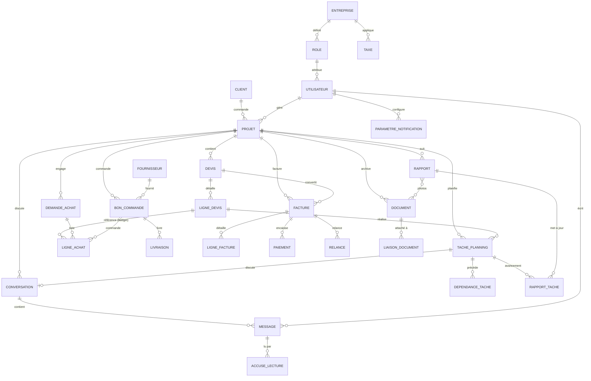

# 02 — Modèle de données (MCD / schéma relationnel)

> **Livrable n°1 du cahier des charges — à valider avant tout développement des modules.**

Ce document décrit le modèle conceptuel de données. L'implémentation cible **Cloud Firestore**
(document/collection) mais le modèle reste **relationnel par références** (`*Id`) : il est
transposable tel quel vers un SGBD relationnel (PostgreSQL) si la stack évolue.

Le code TypeScript de ces entités fait foi et est maintenu dans
[`src/types/models.ts`](../src/types/models.ts).

## 1. Socle commun à toutes les entités (§2)

Toute entité métier hérite de `EntiteBase`, qui matérialise les exigences transverses :

| Champ | Type | Rôle |
| --- | --- | --- |
| `id` | ID | Identifiant unique |
| `etat` | `actif` \| `archive` \| `annule` \| `supprime` | Cycle de vie |
| `creeLe` / `creePar` | Horodatage / ID | Audit création |
| `modifieLe` / `modifiePar` | Horodatage / ID | Audit modification |
| `supprimeLe` / `supprimePar` | Horodatage / ID | **Soft-delete** |
| `archiveLe` / `archivePar` | Horodatage / ID | **Archivage** (lecture seule) |
| `annulation` | `{ annuleLe, annulePar, motif }` | **Annulation** — motif OBLIGATOIRE |

Les entités rattachées à un chantier héritent en plus de `EntiteProjet` (ajoute `projetId`).

## 2. Diagramme entité-association

## 3. Collections Firestore

Chaque entité correspond à une collection racine indexée par `projetId` (sauf référentiels
globaux). Les sous-collections denses en écriture (ex. `messages`) peuvent être imbriquées
sous leur parent pour la scalabilité.

| Collection | Clés étrangères principales | Notes |
| --- | --- | --- |
| `projets` | `clientId` | Nœud central |
| `clients` | — | Référentiel |
| `fournisseurs` | — | Référentiel |
| `utilisateurs` | — | Référentiel (lié à Firebase Auth `uid`) |
| `devis` | `projetId` | En-tête, totaux dénormalisés |
| `lignesDevis` | `projetId`, `devisId` | |
| `tachesPlanning` | `projetId`, `ligneDevisId?`, `responsableId?` | |
| `dependancesTache` | `projetId`, `tachePredecesseurId`, `tacheSuccesseurId` | Type FD/DD/FF/DF + décalage |
| `demandesAchat` | `projetId`, `demandeurId` | |
| `bonsCommande` | `projetId`, `fournisseurId`, `demandeAchatId?` | |
| `lignesAchat` | `projetId`, `bonCommandeId?`, `ligneDevisId?` | `ligneDevisId` = contrôle budgétaire |
| `livraisons` | `projetId`, `bonCommandeId` | |
| `factures` | `projetId`, `devisId?` | Type acompte/situation/solde/avoir |
| `lignesFacture` | `projetId`, `factureId` | |
| `paiements` | `projetId`, `factureId` | |
| `relances` | `projetId`, `factureId` | |
| `rapports` | `projetId`, `auteurId`, `photoIds[]` | |
| `rapportsTache` | `projetId`, `rapportId`, `tachePlanningId` | Met à jour l'avancement |
| `documents` | `projetId?`, `uploadePar` | URL Firebase Storage |
| `liaisonsDocument` | `documentId`, `entiteType`, `entiteId` | Pièce jointe polymorphe |
| `conversations` | `projetId?`, `participantIds[]`, `tachePlanningId?` | |
| `messages` | `conversationId`, `auteurId`, `partage?` | Média via Storage |
| `accusesLecture` | `messageId`, `utilisateurId` | Accusés de lecture |
| `entreprise` | — | Singleton (paramètres) |
| `roles` | — | RBAC |
| `taxes` | — | Configuration TVA |
| `parametresNotification` | `utilisateurId` | |

## 4. Règles de gestion notables

1. **Intégrité projet** — aucune entité `EntiteProjet` sans `projetId` valide.
2. **Archivage en cascade** — l'archivage/suppression d'un projet propose l'archivage de
   toutes les entités liées (§3.1). À implémenter via Cloud Function ou batch client.
3. **Contrôle budgétaire achat** — à la saisie d'une `LigneAchat` référençant une
   `LigneDevis`, alerter si `quantite`/`prixUnitaire` dépasse la référence du devis (§3.2/§3.4).
4. **Conversion devis → facture** — génère une `Facture` (+ `LigneFacture`) à partir du
   devis accepté, selon le type (acompte/situation/solde) et l'avancement (§3.5).
5. **Avancement** — `RapportTache.avancementPct` met à jour `TachePlanning.avancementPct`
   (dernier rapport faisant foi) et alimente le statut de la tâche.
6. **Annulation** — un document `emise/validé` ne se supprime pas : il s'annule avec motif
   obligatoire (transition d'`etat` vers `annule`), préservant la traçabilité comptable.
7. **Totaux dénormalisés** — `totalHT/TVA/TTC` sont recalculés à chaque modification de ligne
   (transaction) pour éviter les lectures d'agrégats.

## 5. Transposition PostgreSQL (si évolution de stack)

Chaque collection devient une table ; les champs `EntiteBase` deviennent des colonnes
communes (idéalement une vue ou un trait applicatif). Les `*Id` deviennent des clés étrangères
avec contraintes `ON DELETE RESTRICT` (le soft-delete restant applicatif via `etat`). Les
tableaux (`participantIds`, `photoIds`) deviennent des tables d'association N-N.
